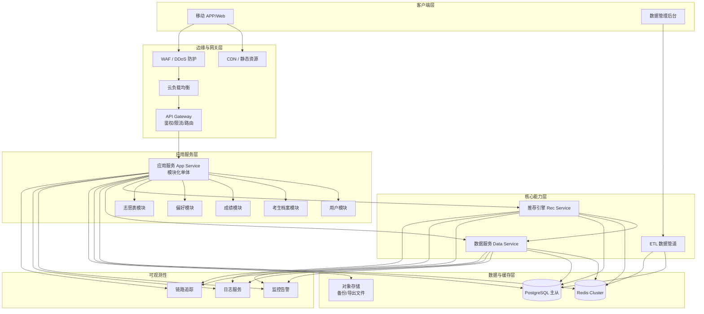
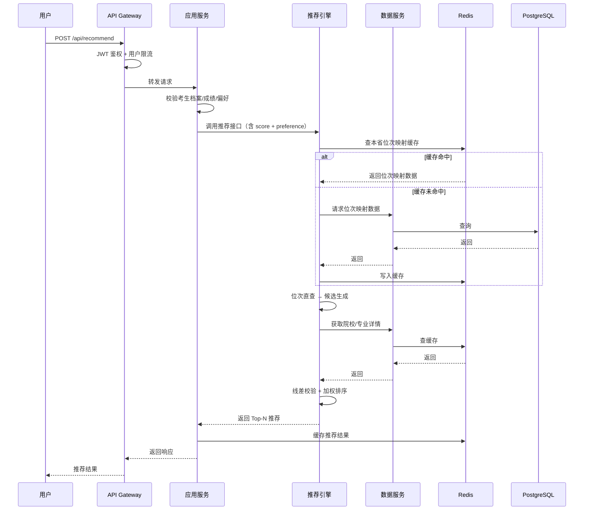
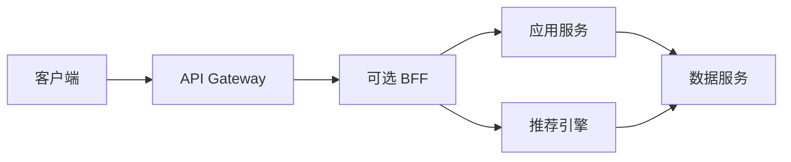
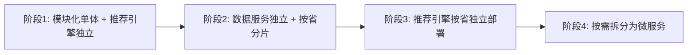

# 高考志愿填报APP · 顶层架构模式与服务拆分 v1.0

> 基于阶段 1 流量模型分析结论：出分日读请求占比 92%、推荐为计算瓶颈、省份天然隔离、峰值需按 15,000 QPS 设计容量。

---

## 1. 架构模式选择

### 1.1 选型对比

| 架构模式 | 优点 | 缺点 | 对本项目适用性 |
|----------|------|------|----------------|
| **单体应用** | 开发简单、部署方便、2 人团队可驾驭 | 无法单独扩展推荐引擎 | ⚠️ 推荐引擎会成为瓶颈 |
| **模块化单体** | 代码边界清晰、统一部署、可逐步拆分 | 仍共享进程，某个模块故障影响整体 | ✅ 适合 MVP |
| **微服务** | 服务独立扩展、技术栈灵活 | 运维复杂、需要服务治理、2 人团队难以承受 | ❌ 不适合 |
| **Serverless** | 自动扩缩容、按量计费、免运维 | 冷启动延迟、长时间运行成本高、调试复杂 | ⚠️ 推荐引擎可用，全 Serverless 有冷启动风险 |
| **混合架构（推荐）** | 主体用模块化单体降低复杂度，推荐引擎独立扩展 | 需要设计好内部接口边界 | ✅✅ **最适配** |

### 1.2 最终选择：混合架构

**模式定义**：
- **应用服务层**：采用模块化单体（Modular Monolith），内部按用户、考生档案、成绩、偏好、志愿表等模块组织代码，统一进程部署。
- **推荐引擎**：独立服务（Recommendation Service），单独部署、单独扩缩容，通过 REST/gRPC 与主应用通信。
- **数据服务**：独立数据访问层，负责院校/专业/分数线/招生计划等基础数据的版本管理和查询，可独立扩展。
- **ETL 管道**：考季前一次性运行的数据导入与预热任务，不常驻。

**选择理由**：
1. **2 人后端团队无法运维 5+ 微服务**：服务网格、分布式事务、多服务监控会压垮小团队。
2. **推荐引擎必须独立**：出分日推荐流量是计算瓶颈，需要独立扩缩容、独立优化、独立缓存。
3. **数据热读冷写**：基础数据服务独立出来，便于缓存预热、按省分片、灰度发布。
4. **渐进式演进**：MVP 阶段用模块化单体快速落地，未来用户量增长后可按模块平滑拆分为微服务。

---

## 2. 服务拆分总览

### 2.1 服务清单

| 服务名 | 类型 | 职责 | 部署形态 | 扩展性 |
|--------|------|------|----------|--------|
| **API Gateway** | 基础设施 | 鉴权、限流、路由、HTTPS 终止 | 云托管网关 | 自动 |
| **应用服务 (App Service)** | 模块化单体 | 用户、考生档案、成绩、偏好、志愿表 | Serverless 容器 | 水平扩展 |
| **推荐引擎 (Rec Service)** | 独立服务 | 位次直查、线差校验、加权排序、推荐生成 | Serverless 容器/独占实例 | 重点扩展 |
| **数据服务 (Data Service)** | 独立服务 | 院校/专业/分数线/招生计划查询与管理 | Serverless 容器 | 中等扩展 |
| **ETL 管道 (Data Pipeline)** | 批处理任务 | 数据导入、校验、预热、版本管理 | 一次性任务/定时任务 | 按需 |
| **可观测性平台** | 云托管 | Metrics、Logs、Trace | 云托管服务 | 自动 |

### 2.2 服务数量控制原则
- **常驻服务仅 4 个**：API Gateway、应用服务、推荐引擎、数据服务。
- 2 人团队可覆盖：1 人负责应用服务 + 数据服务，1 人负责推荐引擎 + 基础设施。
- 不引入消息队列自管集群，必要时使用云托管消息服务。

---

## 3. 服务拓扑图

### 3.1 总体架构图

### 3.2 核心调用链路图

---

## 4. 每个服务详细说明

### 4.1 API Gateway

| 属性 | 说明 |
|------|------|
| **职责** | HTTPS 终止、JWT 鉴权、请求限流、路由转发、协议转换、日志记录 |
| **依赖** | 无（向上游转发） |
| **数据 ownership** | 无持久化数据，仅缓存会话/限流状态到 Redis |
| **对外接口** | REST / HTTPS |
| **内部接口** | 转发 HTTP 到应用服务 |
| **托管组件** | 云厂商 API Gateway（如阿里云 API Gateway、腾讯云 API Gateway、AWS API Gateway） |

**核心功能**：
- **鉴权**：校验 JWT Token，拒绝非法请求。
- **限流**：
  - 全局限流：防止总流量超过后端容量。
  - 用户级限流：推荐接口 10 次/分钟/用户。
  - IP 级限流：防止恶意刷接口。
- **路由**：`/api/users/*` → 应用服务用户模块；`/api/recommend/*` → 推荐引擎。
- **协议转换**：外部 REST，内部可转发为 REST 或 gRPC（MVP 优先 REST）。

### 4.2 应用服务（App Service）

| 属性 | 说明 |
|------|------|
| **职责** | 用户注册登录、考生档案、成绩录入、偏好设置、志愿表 CRUD、导出 |
| **类型** | 模块化单体 |
| **内部模块** | 用户模块、考生模块、成绩模块、偏好模块、志愿表模块 |
| **依赖** | 推荐引擎、数据服务、PostgreSQL、Redis、对象存储 |
| **数据 ownership** | users、candidates、scores、preferences、wishlists、recommendations |
| **对外接口** | REST |
| **内部接口** | HTTP 调用推荐引擎和数据服务 |
| **部署形态** | Serverless 容器（如阿里云 SAE、腾讯云 Serverless Kubernetes） |

**模块边界**：
- 各模块通过内部函数调用或本地事件总线通信，不跨网络。
- 数据库表按模块划分，但共享同一个数据库实例（通过 schema 或前缀区分）。

### 4.3 推荐引擎（Rec Service）

| 属性 | 说明 |
|------|------|
| **职责** | 位次直查、线差校验、3 年加权排序、偏好权重应用、推荐生成 |
| **类型** | 独立服务 |
| **依赖** | 数据服务、PostgreSQL 只读副本、Redis |
| **数据 ownership** | 预计算位次区间映射表（rank_range_mappings）、推荐缓存 |
| **对外接口** | REST（MVP）/ gRPC（可选优化） |
| **内部接口** | 从数据服务获取院校/专业/分数线数据 |
| **部署形态** | 独占容器实例 + Serverless 容器混合，支持快速扩容 |

**独立原因**：
- 出分日推荐流量占 10.7%，但计算资源消耗可能占整体 50% 以上。
- 需要加载本省热数据到内存，内存需求高于普通服务。
- 需要独立优化算法、独立压测、独立灰度发布。

### 4.4 数据服务（Data Service）

| 属性 | 说明 |
|------|------|
| **职责** | 院校、专业、招生计划、历年分数线、位次映射表等基础数据的查询与管理 |
| **类型** | 独立服务 |
| **依赖** | PostgreSQL、Redis |
| **数据 ownership** | universities、majors、university_plans、admission_scores、rank_range_mappings |
| **对外接口** | 内部 REST（不直接对外） |
| **内部接口** | 为应用服务和推荐引擎提供数据查询 |
| **部署形态** | Serverless 容器 |

**设计要点**：
- 所有基础数据查询优先走 Redis 缓存。
- 支持按省份分片查询，便于未来按省独立部署。
- 不直接对外暴露，避免基础数据被滥用。

### 4.5 ETL 数据管道

| 属性 | 说明 |
|------|------|
| **职责** | 考季前导入院校/专业/招生计划/分数线数据，执行校验、版本管理、缓存预热 |
| **类型** | 批处理任务 |
| **依赖** | PostgreSQL、Redis、对象存储 |
| **数据 ownership** | 基础数据版本快照 |
| **对外接口** | 管理后台触发 |
| **部署形态** | 一次性容器任务 / 定时任务 |

**触发时机**：
- 考季前批量导入历史数据。
- 招生计划公布后更新当年数据。
- 出分前 1 周完成最终校验和缓存预热。

---

## 5. 数据 Ownership 矩阵

| 数据域 | 所属服务 | 读写特征 | 存储 |
|--------|----------|----------|------|
| 用户账号 | 应用服务 | 读写均衡 | PostgreSQL |
| 考生档案 | 应用服务 | 写多读少 | PostgreSQL |
| 成绩 | 应用服务 | 写多读少 | PostgreSQL |
| 偏好设置 | 应用服务 | 写多读少 | PostgreSQL |
| 推荐记录 | 应用服务 | 写多读少 | PostgreSQL |
| 志愿表 | 应用服务 | 读写混合 | PostgreSQL |
| 院校信息 | 数据服务 | 只读 | PostgreSQL + Redis |
| 专业信息 | 数据服务 | 只读 | PostgreSQL + Redis |
| 招生计划 | 数据服务 | 只读 | PostgreSQL + Redis |
| 历年分数线 | 数据服务 | 只读 | PostgreSQL + Redis |
| 位次区间映射 | 推荐引擎/数据服务 | 只读 | PostgreSQL + Redis + 本地内存 |
| 推荐结果缓存 | 推荐引擎 | 只读 | Redis |
| 会话/限流 | API Gateway | 读写 | Redis |
| 导出文件 | 应用服务 | 写多读少 | 对象存储 |

---

## 6. API Gateway / BFF 层设计

### 6.1 分层职责

**MVP 阶段**：
- 不引入独立 BFF 服务，API Gateway 直接路由到后端服务。
- 应用服务内部聚合数据后返回给前端，承担部分 BFF 职责。

**未来演进**：
- 当客户端类型增多（iOS/Android/Web/小程序）或前端需要频繁聚合接口时，再引入 BFF 层。

### 6.2 API Gateway 详细设计

| 功能 | 实现方式 | 说明 |
|------|----------|------|
| **HTTPS 终止** | 云负载均衡 + 云证书管理 | 统一证书管理 |
| **JWT 鉴权** | Gateway 层校验 Access Token | 非法请求在网关层拦截 |
| **全局限流** | 令牌桶算法，限制总 QPS | 防止后端过载 |
| **用户级限流** | 基于 user_id 的令牌桶 | 推荐接口 10 次/分钟 |
| **IP 级限流** | 基于客户端 IP | 防止刷接口 |
| **路由** | 路径前缀路由 | `/api/users/*` → 应用服务；`/api/recommend/*` → 推荐引擎 |
| **灰度发布** | Header/Cookie 路由 | 按用户比例灰度 |
| **请求日志** | 记录请求 ID、耗时、状态码 | 用于链路追踪 |
| **错误统一返回** | 统一错误码格式 | `{code, message, traceId}` |

### 6.3 限流策略

| 接口 | 用户级限流 | IP 级限流 | 全局限流 |
|------|------------|-----------|----------|
| 登录/注册 | 5 次/分钟 | 20 次/分钟 | 100 QPS |
| 短信验证码 | 1 次/分钟 | 10 次/分钟 | 50 QPS |
| 获取推荐 | 10 次/分钟 | 100 次/分钟 | 3,000 QPS |
| 院校/专业查询 | 60 次/分钟 | 300 次/分钟 | 8,000 QPS |
| 成绩提交 | 10 次/分钟 | 50 次/分钟 | 500 QPS |
| 保存志愿表 | 20 次/分钟 | 100 次/分钟 | 200 QPS |

---

## 7. 托管服务与云组件推荐

### 7.1 推荐云组件清单

| 组件 | 推荐类型 | 推荐产品示例 | 选择理由 |
|------|----------|--------------|----------|
| **API Gateway** | 托管网关 | 阿里云 API Gateway / 腾讯云 API Gateway | 免运维、内置限流鉴权 |
| **负载均衡** | 云负载均衡 | 阿里云 SLB / 腾讯云 CLB | 高可用、自动故障转移 |
| **WAF/DDoS** | 托管安全 | 阿里云 WAF / 腾讯云 WAF | 出分日临时启用高防 |
| **计算** | Serverless 容器 | 阿里云 SAE / 腾讯云 EKS Serverless | 自动扩缩容、按量计费 |
| **数据库** | 托管 PostgreSQL | 阿里云 RDS PostgreSQL / 腾讯云 PostgreSQL | 自动备份、主从切换 |
| **缓存** | 托管 Redis | 阿里云 Redis / 腾讯云 Redis | 高可用集群 |
| **对象存储** | 云对象存储 | 阿里云 OSS / 腾讯云 COS | 备份与导出文件 |
| **日志** | 托管日志服务 | 阿里云 SLS / 腾讯云 CLS | 免运维、可检索 |
| **监控** | 托管监控 | 阿里云 Prometheus / 腾讯云 Prometheus | 与云资源集成 |
| **链路追踪** | 托管 APM | 阿里云 ARMS / 腾讯云 APM | 低接入成本 |
| **CDN** | 云 CDN | 阿里云 CDN / 腾讯云 CDN | 静态资源加速 |

### 7.2 不自行搭建的组件
- **不自建 K8s 控制面**：使用 Serverless 容器或托管 K8s。
- **不自建消息队列**：MVP 不需要；如未来需要，使用云托管消息服务。
- **不自建 Elasticsearch**：院校搜索使用数据库 GIN 索引或云托管搜索引擎。
- **不自建监控/日志**：全部使用云托管可观测性服务。

---

## 8. 运维负担评估

### 8.1 2 人团队分工建议

| 人员 | 主要职责 | 负责服务/组件 |
|------|----------|----------------|
| **后端工程师 A** | 应用服务 + 数据服务 + API Gateway | App Service、Data Service、Gateway、数据库 |
| **后端工程师 B** | 推荐引擎 + 基础设施 + 可观测性 | Rec Service、Redis、监控告警、CI/CD、压测 |

### 8.2 运维复杂度控制
- **常驻服务仅 4 个**，部署流水线统一。
- **数据库/缓存/网关全部托管**，无需关注底层高可用。
- **推荐引擎独立**，可单独发布、单独回滚。
- **日志/监控/告警统一接入云托管服务**，开箱即用。

### 8.3 日常运维任务
| 任务 | 频率 | 耗时 |
|------|------|------|
| 查看监控告警 | 每日 | 10 分钟 |
| 处理线上异常 | 按需 | - |
| 发布新版本 | 每周 | 30 分钟（CI/CD 自动化） |
| 数据导入校验 | 考季前 | 2-4 小时 |
| 全链路压测 | 出分前 | 1-2 天 |
| 出分日值班 | 出分日 | 全天 |

---

## 9. 扩展性设计

### 9.1 水平扩展能力

| 服务 | 扩展方式 | 触发条件 |
|------|----------|----------|
| 应用服务 | HPA 按 CPU/内存/QPS 扩容 | CPU > 60% 或 QPS 达到阈值 |
| 推荐引擎 | HPA + 独占实例升配 | 推荐延迟 > 300ms 或队列堆积 |
| 数据服务 | HPA 按 QPS 扩容 | 查询延迟 > 100ms |
| PostgreSQL | 只读副本扩展 + 临时升配 | 读压力过高 |
| Redis | 集群分片扩展 + 临时升配 | 缓存命中率下降或连接数过高 |

### 9.2 按省份分片能力
- **数据层**：`admission_scores`、`university_plans`、`rank_range_mappings` 按 `province_code` 分区。
- **缓存层**：Redis 中本省数据独立 Key 前缀，便于按省失效和预热。
- **服务层**：推荐引擎实例可按省份标签路由，未来可演进为按省独立部署。

### 9.3 渐进式演进路径

---

## 10. 关键决策与取舍

| 决策点 | 选择 | 取舍 | 回退方案 |
|--------|------|------|----------|
| **架构模式** | 模块化单体 + 推荐/数据独立 | 牺牲部分独立扩展性，降低运维复杂度 | 未来按模块拆分为微服务 |
| **通信协议** | REST 全部（MVP） | 延迟略高于 gRPC，但开发和调试更简单 | 推荐引擎内部可升级为 gRPC |
| **BFF 层** | MVP 不引入 | 应用服务承担部分聚合职责 | 前端复杂后引入独立 BFF |
| **消息队列** | MVP 不使用 | 异步能力有限 | 使用云托管消息服务或数据库轮询 |
| **部署形态** | Serverless 容器 | 出分日按量成本略高 | 长期稳定后可改用预留实例 |

---

## 11. 对后续阶段的输入

1. **数据架构**：应用服务和数据服务共享 PostgreSQL 实例，通过 schema 隔离；推荐引擎可绑定只读副本。
2. **推荐引擎**：独立服务，需要设计预计算表 `rank_range_mappings` 和本地缓存策略。
3. **缓存设计**：API Gateway 限流状态、数据服务热数据、推荐引擎位次映射表均需进入 Redis。
4. **高可用**：应用服务无状态多实例部署；推荐引擎多实例 + 本地缓存一致性问题需处理。
5. **安全**：API Gateway 层完成鉴权和限流，应用服务层完成权限校验。
