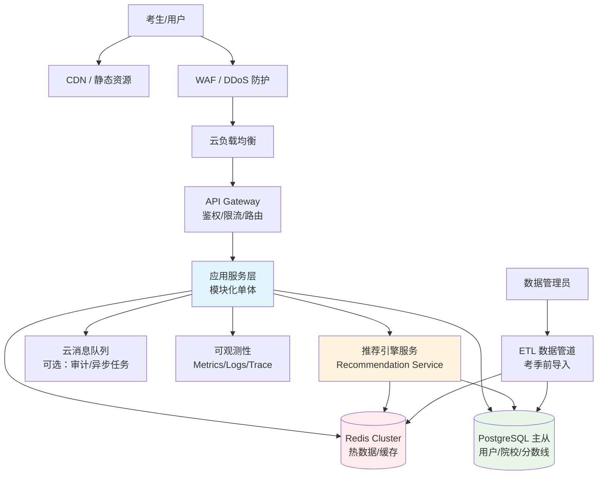
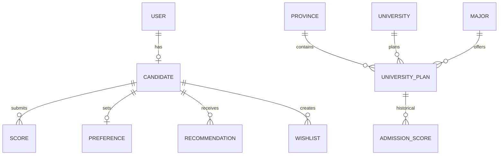
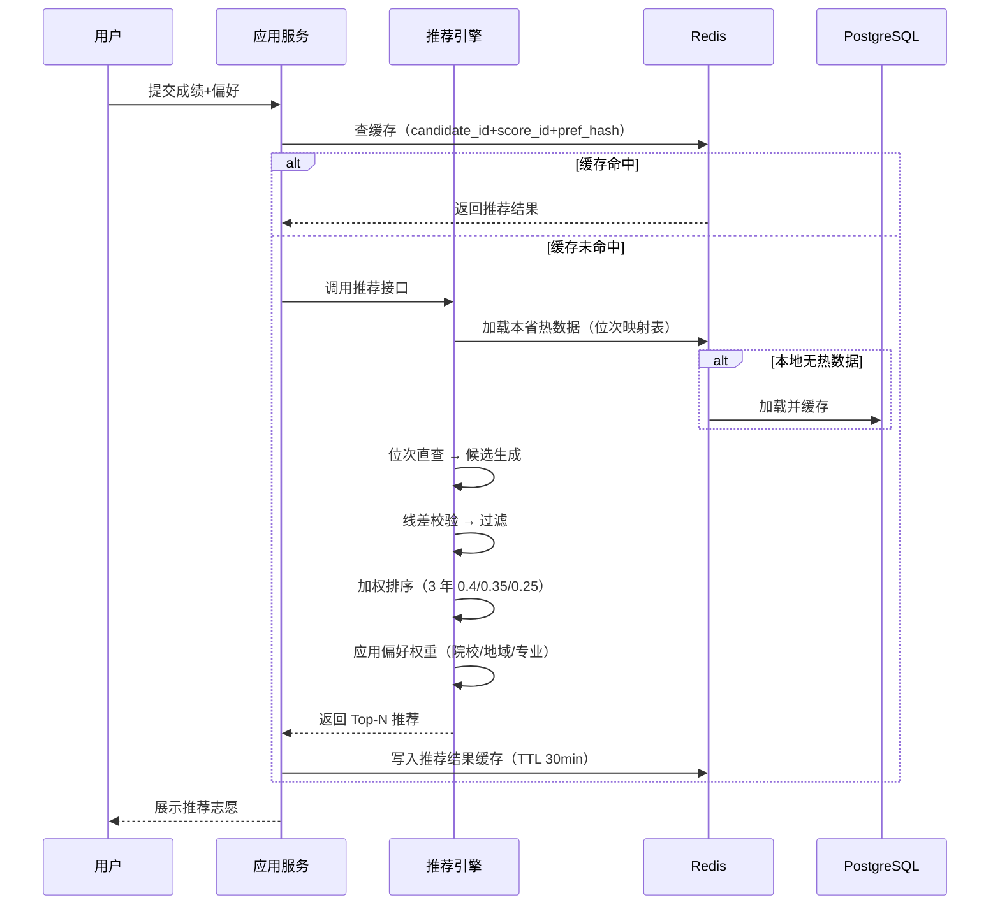
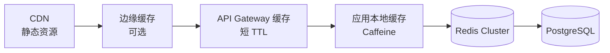

# 高考志愿填报APP · 后端架构方案 v1.0

> 面向 MVP 核心模块「考生成绩/意向采集与智能推荐引擎」，目标支撑 Top10 省出分日峰值流量。

---

## 1. 设计目标与约束

| 指标 | 目标值 | 说明 |
|------|--------|------|
| 峰值 QPS | ≥ 10,000 | 出分日峰值，推荐+查询混合流量 |
| 推荐接口 P95 | < 500ms | 含网络往返，单次推荐返回 20-50 条志愿 |
| 查询接口 P95 | < 200ms | 院校/专业/分数线查询 |
| SLA | ≥ 99.9% | 出分日关键链路可用性 |
| 数据准确性 | 100% | 分数线、位次、招生计划不允许出错 |
| 团队规模 | 2 后端 | 优先托管服务，避免自研中间件 |
| 成本约束 | 适中 | 日常可缩容，考季前/出分日可扩容 |

### 关键约束
1. **后端仅 2 人**：不引入需要专职运维的中间件（如自研 Kafka、自管 K8s 控制面）。
2. **流量潮汐明显**：出分后 3-5 天是全年峰值，其余时间流量 < 5%。
3. **数据热读冷写**：院校/专业/分数线在考季前固化，考季内只读。
4. **地域隔离强**：用户只关心本省数据，天然可按省分片。

---

## 2. 总体架构

### 2.1 架构决策
| 维度 | 选择 | 理由 |
|------|------|------|
| 架构模式 | **模块化单体 + 推荐引擎独立服务** | 2 人团队无法运维 5+ 微服务；推荐引擎计算密集，独立出来可单独扩缩容。 |
| 通信协议 | **REST（对外）+ 内部函数调用/消息队列** | REST 简单通用；内部推荐引擎用 gRPC 可选，但 MVP 优先 HTTP/JSON 降低复杂度。 |
| 数据模式 | **传统 CRUD + 读模型缓存** | 业务相对明确，CQRS/Event Sourcing 过重，不适合 MVP。 |
| 部署模式 | **云托管容器（Serverless K8s / 云原生容器）** | 免运维节点，按需扩缩容，适合潮汐流量。 |
| 数据库 | **PostgreSQL 主从 + Redis Cluster** | PG 复杂查询与索引能力强；Redis 承载热数据与推荐缓存。 |

### 2.2 架构图



### 2.3 流量路径
1. 静态资源走 CDN。
2. API 请求经 WAF → 负载均衡 → API Gateway。
3. API Gateway 完成鉴权、限流、路由。
4. 读请求优先命中缓存；写请求进入应用服务 → 数据库。
5. 推荐请求路由到推荐引擎服务，利用预计算表 + 缓存快速返回。

---

## 3. 服务拆分

### 3.1 服务矩阵

| 服务名 | 职责 | 数据库 | 缓存 | 接口类型 | 扩缩容 |
|--------|------|--------|------|----------|--------|
| **API Gateway** | 鉴权、限流、路由、协议转换 | 无 | 无 | REST | 自动 |
| **应用服务 (App Service)** | 用户、考生档案、成绩、偏好、志愿表 CRUD | PostgreSQL | Redis | REST | 自动 |
| **推荐引擎 (Rec Service)** | 位次直查、线差校验、加权排序、推荐生成 | PostgreSQL + 预计算表 | Redis | REST/gRPC | 重点扩容 |
| **数据服务 (Data Service)** | 院校/专业/分数线/招生计划管理 | PostgreSQL | Redis | 内部调用 | 低 |
| **ETL 管道** | 考季前数据导入、校验、预热 | PostgreSQL | Redis | 内部 | 一次性 |

### 3.2 服务边界说明
- **应用服务**：承载所有与用户行为相关的写操作和轻量读操作。保持无状态，便于水平扩展。
- **推荐引擎**：唯一有状态/计算密集的服务，内部可加载本省热数据到内存，推荐结果不持久化（除非用户保存）。
- **数据服务**：负责基础数据的版本管理和查询，不直接对外暴露，仅供应用服务和推荐引擎调用。

---

## 4. 数据架构

### 4.1 核心实体 ER



### 4.2 关键表结构

```sql
-- 用户表
CREATE TABLE users (
    id UUID PRIMARY KEY DEFAULT gen_random_uuid(),
    phone VARCHAR(20) UNIQUE NOT NULL,
    password_hash VARCHAR(255), -- 如使用短信登录可为空
    wechat_openid VARCHAR(64) UNIQUE,
    created_at TIMESTAMPTZ DEFAULT NOW(),
    updated_at TIMESTAMPTZ DEFAULT NOW(),
    last_login_at TIMESTAMPTZ
);
CREATE INDEX idx_users_phone ON users(phone);
CREATE INDEX idx_users_wechat ON users(wechat_openid);

-- 考生档案表
CREATE TABLE candidates (
    id UUID PRIMARY KEY DEFAULT gen_random_uuid(),
    user_id UUID NOT NULL REFERENCES users(id),
    name VARCHAR(100) NOT NULL,
    id_card_hash VARCHAR(255) NOT NULL, -- 脱敏存储
    province_code VARCHAR(10) NOT NULL,
    exam_type VARCHAR(20) NOT NULL, -- 物理/历史/综合
    created_at TIMESTAMPTZ DEFAULT NOW(),
    updated_at TIMESTAMPTZ DEFAULT NOW()
);
CREATE INDEX idx_candidates_user ON candidates(user_id);
CREATE INDEX idx_candidates_province ON candidates(province_code);

-- 成绩表（每次考试一条，出分后录入）
CREATE TABLE scores (
    id UUID PRIMARY KEY DEFAULT gen_random_uuid(),
    candidate_id UUID NOT NULL REFERENCES candidates(id),
    year SMALLINT NOT NULL,
    total_score DECIMAL(6,2) NOT NULL,
    rank INTEGER NOT NULL, -- 全省位次
    subject_scores JSONB, -- 各科成绩
    batch VARCHAR(20), -- 本科批/专科批
    created_at TIMESTAMPTZ DEFAULT NOW()
);
CREATE INDEX idx_scores_candidate ON scores(candidate_id, year);
CREATE INDEX idx_scores_rank ON scores(province_code, exam_type, year, rank);
-- 注意：province_code 需通过 candidates 表 JOIN 或冗余字段

-- 偏好设置表
CREATE TABLE preferences (
    id UUID PRIMARY KEY DEFAULT gen_random_uuid(),
    candidate_id UUID NOT NULL REFERENCES candidates(id),
    university_weight DECIMAL(3,2) NOT NULL DEFAULT 0.33,
    region_weight DECIMAL(3,2) NOT NULL DEFAULT 0.33,
    major_weight DECIMAL(3,2) NOT NULL DEFAULT 0.33,
    preferred_regions TEXT[], -- 意向省份
    preferred_majors TEXT[], -- 意向专业大类
    avoid_majors TEXT[],
    risk_tolerance VARCHAR(10) DEFAULT 'balanced', -- conservative/balanced/aggressive
    created_at TIMESTAMPTZ DEFAULT NOW(),
    updated_at TIMESTAMPTZ DEFAULT NOW()
);
CREATE INDEX idx_preferences_candidate ON preferences(candidate_id);

-- 院校表（只读热数据）
CREATE TABLE universities (
    id UUID PRIMARY KEY DEFAULT gen_random_uuid(),
    code VARCHAR(20) UNIQUE NOT NULL,
    name VARCHAR(200) NOT NULL,
    province_code VARCHAR(10) NOT NULL,
    city VARCHAR(100),
    level VARCHAR(50), -- 985/211/双一流/普通本科
    type VARCHAR(50), -- 综合/理工/师范
    tags TEXT[],
    is_211 BOOLEAN DEFAULT FALSE,
    is_985 BOOLEAN DEFAULT FALSE
);
CREATE INDEX idx_universities_code ON universities(code);
CREATE INDEX idx_universities_province ON universities(province_code);
CREATE INDEX idx_universities_tags ON universities USING GIN(tags);

-- 专业表（只读热数据）
CREATE TABLE majors (
    id UUID PRIMARY KEY DEFAULT gen_random_uuid(),
    code VARCHAR(20) UNIQUE NOT NULL,
    name VARCHAR(200) NOT NULL,
    category VARCHAR(100), -- 学科门类
    subject_requirements TEXT[] -- 选科要求
);
CREATE INDEX idx_majors_code ON majors(code);
CREATE INDEX idx_majors_category ON majors(category);

-- 招生计划表（只读热数据，按省/年/批次）
CREATE TABLE university_plans (
    id UUID PRIMARY KEY DEFAULT gen_random_uuid(),
    university_id UUID NOT NULL REFERENCES universities(id),
    major_id UUID NOT NULL REFERENCES majors(id),
    province_code VARCHAR(10) NOT NULL,
    year SMALLINT NOT NULL,
    batch VARCHAR(20) NOT NULL,
    plan_count INTEGER NOT NULL DEFAULT 0,
    tuition DECIMAL(10,2),
    duration SMALLINT,
    subject_requirements TEXT[],
    UNIQUE(province_code, year, university_id, major_id, batch)
);
CREATE INDEX idx_plans_query ON university_plans(province_code, year, batch);
CREATE INDEX idx_plans_university ON university_plans(university_id, province_code, year);
CREATE INDEX idx_plans_major ON university_plans(major_id);

-- 历年录取分数/位次表（只读热数据，按省/年）
CREATE TABLE admission_scores (
    id UUID PRIMARY KEY DEFAULT gen_random_uuid(),
    university_id UUID NOT NULL REFERENCES universities(id),
    major_id UUID NOT NULL REFERENCES majors(id),
    province_code VARCHAR(10) NOT NULL,
    year SMALLINT NOT NULL,
    batch VARCHAR(20) NOT NULL,
    min_score DECIMAL(6,2),
    avg_score DECIMAL(6,2),
    min_rank INTEGER,
    avg_rank INTEGER,
    plan_count INTEGER,
    UNIQUE(province_code, year, university_id, major_id, batch)
);
CREATE INDEX idx_admission_query ON admission_scores(province_code, year, batch);
CREATE INDEX idx_admission_rank ON admission_scores(province_code, year, min_rank);
CREATE INDEX idx_admission_university ON admission_scores(university_id, province_code, year);

-- 预计算位次区间映射表（核心推荐加速表）
CREATE TABLE rank_range_mappings (
    id UUID PRIMARY KEY DEFAULT gen_random_uuid(),
    province_code VARCHAR(10) NOT NULL,
    year SMALLINT NOT NULL,
    exam_type VARCHAR(20) NOT NULL,
    batch VARCHAR(20) NOT NULL,
    rank_min INTEGER NOT NULL,
    rank_max INTEGER NOT NULL,
    university_id UUID NOT NULL REFERENCES universities(id),
    major_id UUID NOT NULL REFERENCES majors(id),
    match_score DECIMAL(4,3) NOT NULL, -- 预计算匹配度
    UNIQUE(province_code, year, exam_type, batch, rank_min, rank_max, university_id, major_id)
);
CREATE INDEX idx_rank_range ON rank_range_mappings(province_code, year, exam_type, batch, rank_min, rank_max);
CREATE INDEX idx_rank_range_match ON rank_range_mappings(province_code, year, exam_type, batch, match_score DESC);

-- 推荐记录表
CREATE TABLE recommendations (
    id UUID PRIMARY KEY DEFAULT gen_random_uuid(),
    candidate_id UUID NOT NULL REFERENCES candidates(id),
    score_id UUID NOT NULL REFERENCES scores(id),
    preference_id UUID NOT NULL REFERENCES preferences(id),
    result JSONB NOT NULL,
    generated_at TIMESTAMPTZ DEFAULT NOW(),
    expires_at TIMESTAMPTZ
);
CREATE INDEX idx_recommendations_candidate ON recommendations(candidate_id, generated_at DESC);

-- 志愿表
CREATE TABLE wishlists (
    id UUID PRIMARY KEY DEFAULT gen_random_uuid(),
    candidate_id UUID NOT NULL REFERENCES candidates(id),
    name VARCHAR(200),
    items JSONB NOT NULL, -- 志愿顺序
    created_at TIMESTAMPTZ DEFAULT NOW(),
    updated_at TIMESTAMPTZ DEFAULT NOW()
);
CREATE INDEX idx_wishlists_candidate ON wishlists(candidate_id);
```

### 4.3 索引策略
- **用户侧**：手机号/微信 OpenID 唯一索引，考生档案按 user_id 索引。
- **热数据侧**：院校、专业、招生计划、历年分数按 `province_code + year + batch` 复合索引，覆盖 95% 查询。
- **推荐侧**：`rank_range_mappings` 是核心加速表，按位次区间建立范围索引。

### 4.4 分片/分区策略
1. **按省份 + 年份分区**：`admission_scores`、`university_plans`、`rank_range_mappings` 按 `province_code` 和 `year` 做范围分区。每个省份每年独立分区，便于归档和清理。
2. **读写分离**：写操作走主库，读操作走只读副本。推荐引擎可绑定只读副本，避免影响主库。
3. **冷热分离**：历史年份数据（3 年前）可迁移到廉价存储，只保留近 3 年在主库。

---

## 5. 推荐引擎架构

### 5.1 推荐流程



### 5.2 候选生成：位次直查
- 使用 `rank_range_mappings` 表，根据 `(province_code, year, exam_type, batch, rank)` 快速定位候选院校专业。
- 位次区间按「冲稳保」划分：
  - 冲：rank × 0.8 ~ rank × 1.0
  - 稳：rank × 0.95 ~ rank × 1.05
  - 保：rank × 1.0 ~ rank × 1.3
- 单次候选集控制在 200-500 条，避免后续计算爆炸。

### 5.3 线差校验
- 计算今年分数与历年分数线的差值（线差）。
- 校验规则：若今年线差低于历年最低线差超过阈值，则降级或剔除。
- 线差作为辅助指标，不替代位次直查。

### 5.4 加权排序
- **历史 3 年加权**：第 N 年 0.4，N-1 年 0.35，N-2 年 0.25。
- **偏好三角权重**：院校层次 0.33、地域 0.33、专业匹配 0.33（可滑动调整）。
- **风险系数**：保守型降低「冲」的比例，激进型提高「冲」的比例。

### 5.5 预计算 vs 实时计算
| 类型 | 内容 | 触发时机 | 存储位置 |
|------|------|----------|----------|
| 预计算 | `rank_range_mappings` 位次区间匹配表 | 考季前数据导入后 | PostgreSQL + Redis |
| 实时计算 | 用户个性化加权排序 | 推荐请求时 | 推荐引擎内存 |

### 5.6 降级方案
- 推荐引擎过载时，返回预计算好的「同分去向」兜底列表（基于往年同位次考生报考热门）。
- 缓存击穿时，从只读副本直接查询 `rank_range_mappings`，避免主库压力。

---

## 6. 缓存与性能优化

### 6.1 多级缓存架构



### 6.2 缓存分层策略

| 数据类型 | 缓存层 | TTL | 说明 |
|----------|--------|-----|------|
| 院校/专业基础信息 | Redis + 本地缓存 | 24h | 几乎不变，可长期缓存 |
| 招生计划/分数线 | Redis | 1h | 考季内不变，但需支持紧急修正 |
| 位次区间映射表 | Redis + 推荐引擎本地内存 | 考季内长期 | 推荐引擎启动时加载 |
| 推荐结果 | Redis | 30min | 同成绩+同偏好可复用 |
| 用户会话/Token | Redis | 2h | 鉴权使用 |
| 热点院校详情 | CDN / 边缘缓存 | 1h | 前端静态化 |

### 6.3 缓存一致性
- **Cache-Aside 模式**：读时先查缓存，未命中再查库并回填。
- **数据更新**：基础数据修正时，通过版本号 + 主动失效通知，清除相关缓存。
- **推荐结果**：不依赖强一致性，30min TTL 内允许与数据库存在微小差异。

### 6.4 热点防护
- **缓存预热**：考季前将 Top10 省所有基础数据、位次映射表加载到 Redis。
- **本地缓存**：推荐引擎服务启动时把本省热数据加载到内存，减少 Redis 网络往返。
- **请求合并**：对相同参数的推荐请求，使用 Singleflight 合并并发请求。
- **限流**：按用户 ID 限流（如 10 次/分钟），防止刷接口。

### 6.5 性能基线

| 接口 | P50 | P95 | P99 | 优化手段 |
|------|-----|-----|-----|----------|
| 院校查询 | 30ms | 80ms | 150ms | Redis + 索引 |
| 分数线查询 | 40ms | 100ms | 200ms | 分区索引 |
| 单次推荐 | 80ms | 300ms | 500ms | 预计算表 + 本地缓存 |
| 成绩提交 | 50ms | 120ms | 200ms | 异步写 |

---

## 7. 高可用与容灾

### 7.1 多可用区部署
- 应用服务：至少 2 个可用区部署，无状态，自动负载均衡。
- 数据库：云托管 PostgreSQL 默认跨 AZ 主从，自动故障转移。
- Redis：云托管 Redis Cluster 跨 AZ 部署。

### 7.2 数据库高可用
- **主从复制**：同步复制关键事务，异步复制非关键查询。
- **自动切换**：主库故障时，云数据库自动提升从库，RTO < 60s。
- **只读副本**：推荐引擎和查询接口绑定只读副本，主库只处理写操作。

### 7.3 限流、熔断与降级
- **限流**：
  - 全局 QPS 限流：API Gateway 层限制总流量。
  - 用户级限流：按 user_id 限制推荐接口调用频率。
  - IP 级限流：防止恶意刷接口。
- **熔断**：推荐引擎响应时间 > 1s 或错误率 > 5% 时，熔断并返回兜底列表。
- **降级**：
  - 推荐引擎过载 → 返回预计算同分去向。
  - 数据库只读副本延迟 → 直接读主库关键数据。
  - Redis 故障 → 降级到数据库直查（有损但可用）。

### 7.4 故障隔离
- **按省份隔离**：不同省份数据独立分区，某省数据异常不影响其他省。
- **服务隔离**：推荐引擎独立部署，故障不扩散到用户/志愿表服务。

### 7.5 备份与恢复
- **数据库**：每日全量备份 + 实时 binlog，保留 30 天。RPO < 5 分钟。
- **Redis**：开启 AOF + RDB 持久化，关键数据可重建。
- **演练**：考季前进行主从切换演练和全链路压测。

### 7.6 RTO/RPO
| 故障场景 | RTO | RPO | 说明 |
|----------|-----|-----|------|
| 应用服务实例故障 | < 30s | 0 | 无状态，自动剔除并重启 |
| 数据库主库故障 | < 60s | < 5min | 自动切换 |
| 单可用区故障 | < 2min | < 5min | 跨 AZ 部署 |
| Redis 集群故障 | < 5min | 0（可重建） | 降级数据库直查 |

---

## 8. 安全与合规

### 8.1 认证与授权
- **登录方式**：手机号验证码 + 微信 OAuth2.0。
- **Token 机制**：JWT（Access Token 15min + Refresh Token 7d），或云厂商托管会话。
- **权限控制**：用户只能访问自己的考生档案、成绩、志愿表，通过 candidate_id 与用户 ID 绑定校验。

### 8.2 数据安全
- **传输加密**：TLS 1.3，HSTS。
- **存储加密**：
  - 身份证号、手机号使用 SHA-256 + 盐哈希存储，不可逆。
  - PostgreSQL 开启 TDE 透明加密。
  - 敏感字段（姓名、电话）展示时脱敏。
- **密码**：如使用密码登录，使用 bcrypt 哈希。

### 8.3 防攻击
- **WAF**：防护 SQL 注入、XSS、CC 攻击。
- **DDoS**：云厂商基础 DDoS 防护 + 高防包（出分日临时启用）。
- **防刷**：
  - 短信验证码：同手机号 1 分钟 1 条，1 小时 5 条，1 天 10 条。
  - 推荐接口：同用户 10 次/分钟，同 IP 100 次/分钟。
  - 设备指纹 + 行为风控（可疑请求额外验证）。

### 8.4 审计与合规
- **审计日志**：成绩提交、推荐生成、志愿表保存、敏感数据查询均记录日志。
- **合规**：遵循《个人信息保护法》，最小化收集数据，用户可删除账号及关联数据。

---

## 9. 部署与运维

### 9.1 部署架构
- **容器化**：应用服务、推荐引擎打包为 Docker 镜像。
- **编排**：使用云厂商托管 Serverless K8s（如阿里云 ASK、腾讯云 EKS Serverless），免运维节点。
- **数据库/缓存**：使用云托管 PostgreSQL 和 Redis，不自行搭建。
- **CI/CD**：GitHub Actions / GitLab CI → 镜像构建 → 镜像仓库 → 自动部署到测试/预发/生产。

### 9.2 自动扩缩容
| 场景 | 策略 | 说明 |
|------|------|------|
| 日常 | 2-4 实例 | 低成本运行 |
| 考季前预热 | 4-8 实例 | 缓存预热、压测 |
| 出分日峰值 | 20-50 实例 | HPA 按 CPU/内存/QPS 自动扩容 |
| 考季后 | 2 实例 | 缩容至最低 |

### 9.3 监控告警
- **Metrics**：QPS、RT、错误率、CPU、内存、GC、DB 连接池、Redis 命中率、主从延迟。
- **Logs**：结构化日志，统一收集到云日志服务。
- **Trace**：全链路追踪，采样率日常 1%，出分日可调至 0.1%。
- **告警**：P95 > 400ms、错误率 > 1%、CPU > 70%、DB 连接池 > 80% 时触发。

### 9.4 压测方案
- **工具**：k6 / Locust。
- **场景**：
  - 日常流量模拟
  - 出分日峰值模拟（10 倍日常）
  - 单省份突发流量模拟
  - 推荐引擎满载测试
- **数据构造**：模拟 100 万考生、Top10 省位次分布、多种偏好组合。
- **通过标准**：P95 < 500ms、错误率 < 0.1%、系统资源 < 80%。

### 9.5 成本估算（月度，出分日峰值）

| 项目 | 日常 | 出分日峰值 | 备注 |
|------|------|------------|------|
| 计算资源（容器） | ¥2,000 | ¥15,000 | 按实例数扩缩 |
| PostgreSQL 主从 | ¥3,000 | ¥3,000 | 固定规格，只读副本临时增加 |
| Redis Cluster | ¥1,500 | ¥4,000 | 临时升配 |
| CDN / 流量 | ¥500 | ¥5,000 | 静态资源与 API 流量 |
| WAF / DDoS 高防 | ¥500 | ¥10,000 | 出分日临时启用高防 |
| 日志/监控 | ¥500 | ¥2,000 | 日志量激增 |
| **合计** | **~¥8,000** | **~¥39,000** | 考季后缩回日常 |

---

## 10. 风险与取舍

| 风险 | 影响 | 取舍 | 应对方案 |
|------|------|------|----------|
| **微服务过度拆分** | 2 人团队无法运维 | 选择模块化单体 + 推荐引擎独立 | 推荐引擎单独扩缩，其余模块同进程部署 |
| **自研消息队列/中间件** | 运维复杂度高 | 使用云托管 Redis / 云消息队列 | 不引入 Kafka/RabbitMQ 自管集群 |
| **推荐结果强一致性** | 缓存可能带来微小延迟 | 推荐结果 TTL 30min 可接受 | 用户重新提交成绩时强制刷新 |
| **出分日流量不可预测** | 可能 10 倍以上峰值 | 预留 5 倍冗余，自动扩容 + 限流 | 出分日前全链路压测，临时升配 |
| **数据准确性风险** | 推荐错误影响考生志愿 | 数据导入多轮校验 + 人工抽检 | ETL 校验规则 + 灰度发布数据 |

---

## 11. 评估标准自检

| 评估项 | 结论 | 说明 |
|--------|------|------|
| 10,000 QPS 下 P95 < 500ms | ✅ 满足 | 预计算位次映射表 + Redis + 本地缓存 |
| 后端 2 人可落地 | ✅ 满足 | 优先云托管服务，模块化单体降低复杂度 |
| 出分日 10 倍流量自动扩容 | ✅ 满足 | Serverless K8s HPA + 临时升配 + 限流降级 |
| 数据一致性满足要求 | ✅ 满足 | 核心数据只读，写操作走主库，ETL 多轮校验 |
| 缓存不导致推荐结果不一致 | ✅ 满足 | 推荐结果 TTL 30min，用户主动刷新可强制失效 |
| 单点故障有转移/降级 | ✅ 满足 | 跨 AZ 部署、数据库自动切换、熔断降级兜底 |

---

## 12. 落地建议（MVP 阶段）

1. **第 1-2 周**：完成数据模型与 ETL 管道，导入 Top10 省历史数据。
2. **第 3-5 周**：实现应用服务（用户/成绩/偏好/志愿表）和推荐引擎 MVP。
3. **第 6-7 周**：接入 Redis 缓存，完成推荐引擎性能优化。
4. **第 8-9 周**：接入 API Gateway、鉴权、限流、监控。
5. **第 10 周**：全链路压测、安全审计、出分日演练。

**下一步关键决策**：是否使用 Serverless 容器（如阿里云 SAE）进一步降低运维成本？建议 2 人团队优先选择 Serverless 容器方案。
