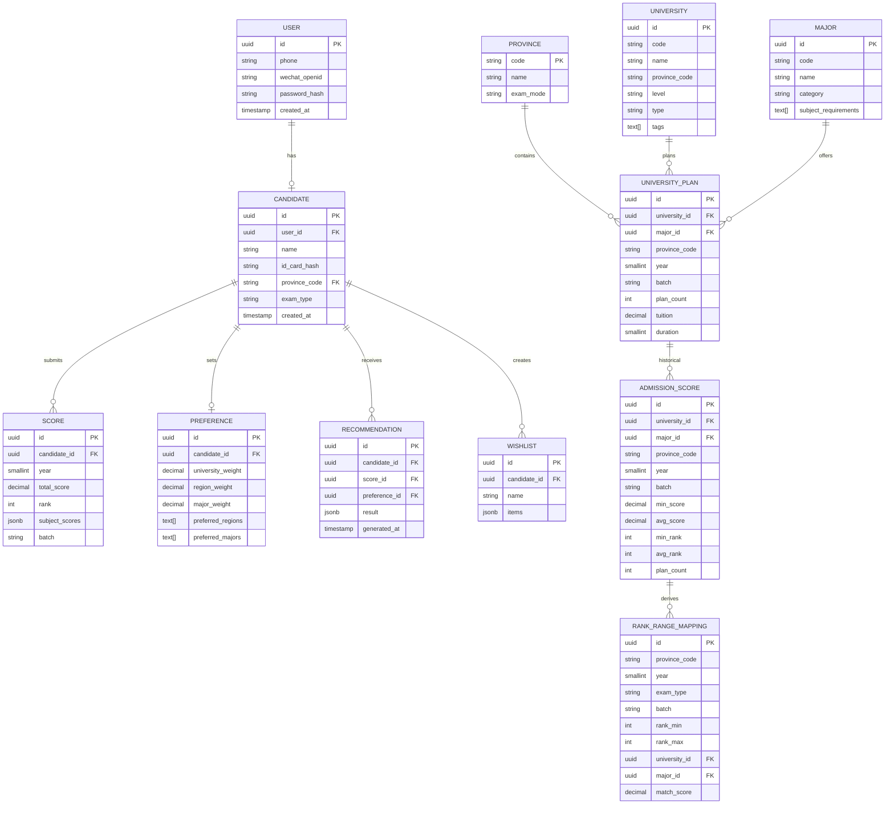
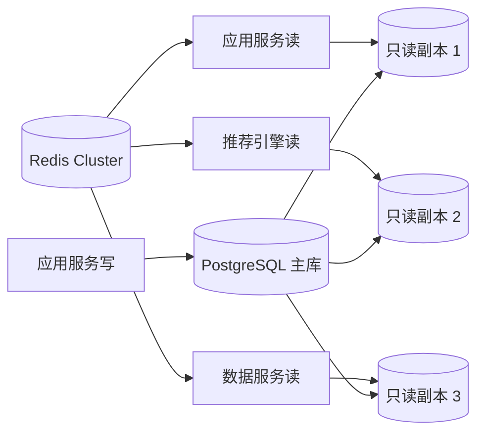

# 高考志愿填报APP · 数据持久化层设计 v1.0

> 基于阶段 2 服务拆分：应用服务、推荐引擎、数据服务共享 PostgreSQL 实例，通过 Schema 隔离；基础热数据按省份+年份分区；读写分离。

---

## 1. 数据架构总览

### 1.1 数据库选型
| 组件 | 选型 | 理由 |
|------|------|------|
| 主数据库 | **PostgreSQL 14+** | 支持复杂查询、窗口函数、GIN/GiST 索引、JSONB、表分区 |
| 缓存 | **Redis Cluster** | 热数据缓存、会话、限流、推荐结果缓存 |
| 对象存储 | **云 OSS/COS** | 导出文件、数据备份快照、日志归档 |
| 搜索引擎 | **PostgreSQL 全文检索/GIN 索引** | MVP 阶段够用，避免引入 Elasticsearch |

### 1.2 Schema 划分
按服务边界划分 Schema，共享同一 PostgreSQL 实例（降低运维复杂度）：

| Schema | 所属服务 | 包含表 |
|--------|----------|--------|
| `app` | 应用服务 | users, candidates, scores, preferences, wishlists, recommendations |
| `data` | 数据服务 | provinces, universities, majors, university_plans, admission_scores |
| `rec` | 推荐引擎 | rank_range_mappings, rec_cache_meta |

### 1.3 数据规模估算

| 表 | 预估行数 | 增长频率 | 特征 |
|----|----------|----------|------|
| users | 30 万 | 持续 | 写多读少 |
| candidates | 30 万 | 持续 | 写多读少 |
| scores | 50 万 | 考季后爆发 | 写多读少 |
| preferences | 30 万 | 持续 | 写多读少 |
| recommendations | 200 万 | 出分日爆发 | 写多读少 |
| wishlists | 50 万 | 考季后 | 读写混合 |
| universities | 3,000 | 极少更新 | 只读热数据 |
| majors | 500 | 极少更新 | 只读热数据 |
| university_plans | 50 万/年 | 每年更新 | 只读热数据 |
| admission_scores | 50 万/年 | 每年更新 | 只读热数据 |
| rank_range_mappings | 100 万/年 | 每年预计算 | 只读热数据 |

---

## 2. 核心实体 ER 图



---

## 3. 完整 DDL

### 3.1 应用服务 Schema（`app`）

```sql
-- 创建 schema
CREATE SCHEMA IF NOT EXISTS app;

-- 用户表
CREATE TABLE app.users (
    id UUID PRIMARY KEY DEFAULT gen_random_uuid(),
    phone VARCHAR(20) UNIQUE,
    phone_hash VARCHAR(64) UNIQUE, -- 用于索引和去重
    wechat_openid VARCHAR(64) UNIQUE,
    password_hash VARCHAR(255),
    status VARCHAR(20) DEFAULT 'active' CHECK (status IN ('active', 'suspended', 'deleted')),
    created_at TIMESTAMPTZ DEFAULT NOW(),
    updated_at TIMESTAMPTZ DEFAULT NOW(),
    last_login_at TIMESTAMPTZ
);
CREATE INDEX idx_users_phone ON app.users(phone_hash);
CREATE INDEX idx_users_wechat ON app.users(wechat_openid);
CREATE INDEX idx_users_created_at ON app.users(created_at);

-- 考生档案表
CREATE TABLE app.candidates (
    id UUID PRIMARY KEY DEFAULT gen_random_uuid(),
    user_id UUID NOT NULL REFERENCES app.users(id) ON DELETE CASCADE,
    name VARCHAR(100) NOT NULL,
    id_card_hash VARCHAR(255) NOT NULL, -- SHA-256 + salt
    province_code VARCHAR(10) NOT NULL,
    exam_type VARCHAR(20) NOT NULL CHECK (exam_type IN ('physics', 'history', 'comprehensive')),
    birth_date DATE,
    status VARCHAR(20) DEFAULT 'active',
    created_at TIMESTAMPTZ DEFAULT NOW(),
    updated_at TIMESTAMPTZ DEFAULT NOW(),
    UNIQUE(user_id, province_code)
);
CREATE INDEX idx_candidates_user ON app.candidates(user_id);
CREATE INDEX idx_candidates_province ON app.candidates(province_code);
CREATE INDEX idx_candidates_id_card ON app.candidates(id_card_hash);

-- 成绩表
CREATE TABLE app.scores (
    id UUID PRIMARY KEY DEFAULT gen_random_uuid(),
    candidate_id UUID NOT NULL REFERENCES app.candidates(id) ON DELETE CASCADE,
    year SMALLINT NOT NULL CHECK (year >= 2020 AND year <= 2030),
    total_score DECIMAL(6,2) NOT NULL CHECK (total_score >= 0 AND total_score <= 750),
    rank INTEGER NOT NULL CHECK (rank > 0),
    batch VARCHAR(20) NOT NULL CHECK (batch IN ('本科批', '专科批', '提前批', '一批', '二批')),
    subject_scores JSONB NOT NULL DEFAULT '{}',
    score_line_diff DECIMAL(6,2), -- 与批次线差值
    verified BOOLEAN DEFAULT FALSE, -- 是否已核验
    created_at TIMESTAMPTZ DEFAULT NOW(),
    updated_at TIMESTAMPTZ DEFAULT NOW(),
    UNIQUE(candidate_id, year)
);
CREATE INDEX idx_scores_candidate_year ON app.scores(candidate_id, year);
CREATE INDEX idx_scores_rank ON app.scores(province_code, exam_type, year, rank);
CREATE INDEX idx_scores_batch ON app.scores(province_code, year, batch);
-- 假设 province_code 通过 candidates 表 JOIN 获取，如需高频直接查询可冗余字段

-- 偏好设置表
CREATE TABLE app.preferences (
    id UUID PRIMARY KEY DEFAULT gen_random_uuid(),
    candidate_id UUID NOT NULL REFERENCES app.candidates(id) ON DELETE CASCADE,
    university_weight DECIMAL(3,2) NOT NULL DEFAULT 0.33 CHECK (university_weight >= 0 AND university_weight <= 1),
    region_weight DECIMAL(3,2) NOT NULL DEFAULT 0.33 CHECK (region_weight >= 0 AND region_weight <= 1),
    major_weight DECIMAL(3,2) NOT NULL DEFAULT 0.34 CHECK (major_weight >= 0 AND major_weight <= 1),
    preferred_regions TEXT[] DEFAULT '{}',
    preferred_majors TEXT[] DEFAULT '{}',
    avoid_majors TEXT[] DEFAULT '{}',
    risk_tolerance VARCHAR(20) DEFAULT 'balanced' CHECK (risk_tolerance IN ('conservative', 'balanced', 'aggressive')),
    zero_preference BOOLEAN DEFAULT FALSE, -- 零偏好模式
    created_at TIMESTAMPTZ DEFAULT NOW(),
    updated_at TIMESTAMPTZ DEFAULT NOW(),
    UNIQUE(candidate_id)
);
CREATE INDEX idx_preferences_candidate ON app.preferences(candidate_id);

-- 推荐记录表
CREATE TABLE app.recommendations (
    id UUID PRIMARY KEY DEFAULT gen_random_uuid(),
    candidate_id UUID NOT NULL REFERENCES app.candidates(id) ON DELETE CASCADE,
    score_id UUID NOT NULL REFERENCES app.scores(id),
    preference_id UUID NOT NULL REFERENCES app.preferences(id),
    result JSONB NOT NULL, -- 推荐结果
    result_hash VARCHAR(64), -- 用于缓存去重
    generated_at TIMESTAMPTZ DEFAULT NOW(),
    expires_at TIMESTAMPTZ,
    UNIQUE(candidate_id, score_id, preference_id, result_hash)
);
CREATE INDEX idx_recommendations_candidate ON app.recommendations(candidate_id, generated_at DESC);
CREATE INDEX idx_recommendations_hash ON app.recommendations(candidate_id, result_hash);

-- 志愿表
CREATE TABLE app.wishlists (
    id UUID PRIMARY KEY DEFAULT gen_random_uuid(),
    candidate_id UUID NOT NULL REFERENCES app.candidates(id) ON DELETE CASCADE,
    name VARCHAR(200) NOT NULL DEFAULT '我的志愿表',
    items JSONB NOT NULL DEFAULT '[]', -- 志愿顺序列表
    version INTEGER DEFAULT 1, -- 乐观锁版本号
    is_default BOOLEAN DEFAULT FALSE,
    created_at TIMESTAMPTZ DEFAULT NOW(),
    updated_at TIMESTAMPTZ DEFAULT NOW()
);
CREATE INDEX idx_wishlists_candidate ON app.wishlists(candidate_id, updated_at DESC);
```

### 3.2 数据服务 Schema（`data`）

```sql
CREATE SCHEMA IF NOT EXISTS data;

-- 省份表
CREATE TABLE data.provinces (
    code VARCHAR(10) PRIMARY KEY,
    name VARCHAR(50) NOT NULL,
    exam_mode VARCHAR(20) NOT NULL CHECK (exam_mode IN ('3+1+2', '3+3', 'comprehensive')),
    total_score DECIMAL(6,2) NOT NULL DEFAULT 750,
    is_active BOOLEAN DEFAULT TRUE
);

-- 院校表
CREATE TABLE data.universities (
    id UUID PRIMARY KEY DEFAULT gen_random_uuid(),
    code VARCHAR(20) UNIQUE NOT NULL,
    name VARCHAR(200) NOT NULL,
    short_name VARCHAR(100),
    province_code VARCHAR(10) NOT NULL REFERENCES data.provinces(code),
    city VARCHAR(100),
    level VARCHAR(50) CHECK (level IN ('985', '211', 'double_first', 'province_key', 'regular')),
    type VARCHAR(50) CHECK (type IN ('综合', '理工', '师范', '医学', '财经', '政法', '农林', '艺术', '体育', '军事')),
    tags TEXT[] DEFAULT '{}',
    is_211 BOOLEAN DEFAULT FALSE,
    is_985 BOOLEAN DEFAULT FALSE,
    is_double_first BOOLEAN DEFAULT FALSE,
    website VARCHAR(255),
    logo_url VARCHAR(500),
    created_at TIMESTAMPTZ DEFAULT NOW(),
    updated_at TIMESTAMPTZ DEFAULT NOW(),
    data_version INTEGER DEFAULT 1
);
CREATE INDEX idx_universities_code ON data.universities(code);
CREATE INDEX idx_universities_province ON data.universities(province_code);
CREATE INDEX idx_universities_level ON data.universities(level) WHERE level IS NOT NULL;
CREATE INDEX idx_universities_tags ON data.universities USING GIN(tags);
CREATE INDEX idx_universities_search ON data.universities USING GIN(to_tsvector('chinese', name || ' ' || COALESCE(short_name, '')));

-- 专业表
CREATE TABLE data.majors (
    id UUID PRIMARY KEY DEFAULT gen_random_uuid(),
    code VARCHAR(20) UNIQUE NOT NULL,
    name VARCHAR(200) NOT NULL,
    category VARCHAR(100) NOT NULL, -- 学科门类
    sub_category VARCHAR(100), -- 专业类
    subject_requirements TEXT[] DEFAULT '{}', -- 选科要求
    duration SMALLINT DEFAULT 4,
    degree VARCHAR(50),
    created_at TIMESTAMPTZ DEFAULT NOW(),
    updated_at TIMESTAMPTZ DEFAULT NOW(),
    data_version INTEGER DEFAULT 1
);
CREATE INDEX idx_majors_code ON data.majors(code);
CREATE INDEX idx_majors_category ON data.majors(category);
CREATE INDEX idx_majors_search ON data.majors USING GIN(to_tsvector('chinese', name));

-- 招生计划表（按省份+年份分区）
CREATE TABLE data.university_plans (
    id UUID PRIMARY KEY DEFAULT gen_random_uuid(),
    university_id UUID NOT NULL REFERENCES data.universities(id),
    major_id UUID NOT NULL REFERENCES data.majors(id),
    province_code VARCHAR(10) NOT NULL REFERENCES data.provinces(code),
    year SMALLINT NOT NULL CHECK (year >= 2020 AND year <= 2030),
    batch VARCHAR(20) NOT NULL,
    plan_count INTEGER NOT NULL DEFAULT 0 CHECK (plan_count >= 0),
    tuition DECIMAL(10,2),
    duration SMALLINT DEFAULT 4,
    subject_requirements TEXT[] DEFAULT '{}',
    notes TEXT,
    data_version INTEGER DEFAULT 1,
    created_at TIMESTAMPTZ DEFAULT NOW(),
    updated_at TIMESTAMPTZ DEFAULT NOW(),
    UNIQUE(province_code, year, university_id, major_id, batch)
) PARTITION BY LIST (province_code);
CREATE INDEX idx_plans_query ON data.university_plans(province_code, year, batch);
CREATE INDEX idx_plans_university ON data.university_plans(university_id, province_code, year);
CREATE INDEX idx_plans_major ON data.university_plans(major_id, province_code, year);
CREATE INDEX idx_plans_subject ON data.university_plans USING GIN(subject_requirements);

-- 历年录取分数/位次表（按省份+年份分区）
CREATE TABLE data.admission_scores (
    id UUID PRIMARY KEY DEFAULT gen_random_uuid(),
    university_id UUID NOT NULL REFERENCES data.universities(id),
    major_id UUID NOT NULL REFERENCES data.majors(id),
    province_code VARCHAR(10) NOT NULL REFERENCES data.provinces(code),
    year SMALLINT NOT NULL CHECK (year >= 2020 AND year <= 2030),
    batch VARCHAR(20) NOT NULL,
    min_score DECIMAL(6,2),
    avg_score DECIMAL(6,2),
    max_score DECIMAL(6,2),
    min_rank INTEGER,
    avg_rank INTEGER,
    max_rank INTEGER,
    plan_count INTEGER DEFAULT 0,
    data_version INTEGER DEFAULT 1,
    created_at TIMESTAMPTZ DEFAULT NOW(),
    updated_at TIMESTAMPTZ DEFAULT NOW(),
    UNIQUE(province_code, year, university_id, major_id, batch)
) PARTITION BY LIST (province_code);
CREATE INDEX idx_admission_query ON data.admission_scores(province_code, year, batch);
CREATE INDEX idx_admission_rank ON data.admission_scores(province_code, year, min_rank);
CREATE INDEX idx_admission_avg_rank ON data.admission_scores(province_code, year, avg_rank);
CREATE INDEX idx_admission_university ON data.admission_scores(university_id, province_code, year);

-- 为 Top10 省创建分区示例（招生计划）
CREATE TABLE data.university_plans_gd PARTITION OF data.university_plans FOR VALUES IN ('44'); -- 广东
CREATE TABLE data.university_plans_ha PARTITION OF data.university_plans FOR VALUES IN ('41'); -- 河南
CREATE TABLE data.university_plans_sd PARTITION OF data.university_plans FOR VALUES IN ('37'); -- 山东
CREATE TABLE data.university_plans_js PARTITION OF data.university_plans FOR VALUES IN ('32'); -- 江苏
CREATE TABLE data.university_plans_sc PARTITION OF data.university_plans FOR VALUES IN ('51'); -- 四川
CREATE TABLE data.university_plans_he PARTITION OF data.university_plans FOR VALUES IN ('13'); -- 河北
CREATE TABLE data.university_plans_hn PARTITION OF data.university_plans FOR VALUES IN ('43'); -- 湖南
CREATE TABLE data.university_plans_ah PARTITION OF data.university_plans FOR VALUES IN ('34'); -- 安徽
CREATE TABLE data.university_plans_hb PARTITION OF data.university_plans FOR VALUES IN ('42'); -- 湖北
CREATE TABLE data.university_plans_zj PARTITION OF data.university_plans FOR VALUES IN ('33'); -- 浙江
CREATE TABLE data.university_plans_default PARTITION OF data.university_plans DEFAULT;

-- 为 Top10 省创建分区示例（分数线）
CREATE TABLE data.admission_scores_gd PARTITION OF data.admission_scores FOR VALUES IN ('44');
CREATE TABLE data.admission_scores_ha PARTITION OF data.admission_scores FOR VALUES IN ('41');
CREATE TABLE data.admission_scores_sd PARTITION OF data.admission_scores FOR VALUES IN ('37');
CREATE TABLE data.admission_scores_js PARTITION OF data.admission_scores FOR VALUES IN ('32');
CREATE TABLE data.admission_scores_sc PARTITION OF data.admission_scores FOR VALUES IN ('51');
CREATE TABLE data.admission_scores_he PARTITION OF data.admission_scores FOR VALUES IN ('13');
CREATE TABLE data.admission_scores_hn PARTITION OF data.admission_scores FOR VALUES IN ('43');
CREATE TABLE data.admission_scores_ah PARTITION OF data.admission_scores FOR VALUES IN ('34');
CREATE TABLE data.admission_scores_hb PARTITION OF data.admission_scores FOR VALUES IN ('42');
CREATE TABLE data.admission_scores_zj PARTITION OF data.admission_scores FOR VALUES IN ('33');
CREATE TABLE data.admission_scores_default PARTITION OF data.admission_scores DEFAULT;
```

### 3.3 推荐引擎 Schema（`rec`）

```sql
CREATE SCHEMA IF NOT EXISTS rec;

-- 预计算位次区间映射表（核心推荐加速表）
CREATE TABLE rec.rank_range_mappings (
    id UUID PRIMARY KEY DEFAULT gen_random_uuid(),
    province_code VARCHAR(10) NOT NULL,
    year SMALLINT NOT NULL CHECK (year >= 2020 AND year <= 2030),
    exam_type VARCHAR(20) NOT NULL CHECK (exam_type IN ('physics', 'history', 'comprehensive')),
    batch VARCHAR(20) NOT NULL,
    rank_min INTEGER NOT NULL CHECK (rank_min > 0),
    rank_max INTEGER NOT NULL CHECK (rank_max >= rank_min),
    university_id UUID NOT NULL,
    major_id UUID NOT NULL,
    match_score DECIMAL(4,3) NOT NULL CHECK (match_score >= 0 AND match_score <= 1),
    risk_label VARCHAR(20) CHECK (risk_label IN ('冲', '稳', '保')),
    data_version INTEGER DEFAULT 1,
    created_at TIMESTAMPTZ DEFAULT NOW(),
    UNIQUE(province_code, year, exam_type, batch, rank_min, rank_max, university_id, major_id)
) PARTITION BY LIST (province_code);
CREATE INDEX idx_rank_range_query ON rec.rank_range_mappings(province_code, year, exam_type, batch, rank_min, rank_max);
CREATE INDEX idx_rank_range_match ON rec.rank_range_mappings(province_code, year, exam_type, batch, match_score DESC);
CREATE INDEX idx_rank_range_risk ON rec.rank_range_mappings(province_code, year, exam_type, batch, risk_label);

-- Top10 省分区
CREATE TABLE rec.rank_range_mappings_gd PARTITION OF rec.rank_range_mappings FOR VALUES IN ('44');
CREATE TABLE rec.rank_range_mappings_ha PARTITION OF rec.rank_range_mappings FOR VALUES IN ('41');
CREATE TABLE rec.rank_range_mappings_sd PARTITION OF rec.rank_range_mappings FOR VALUES IN ('37');
CREATE TABLE rec.rank_range_mappings_js PARTITION OF rec.rank_range_mappings FOR VALUES IN ('32');
CREATE TABLE rec.rank_range_mappings_sc PARTITION OF rec.rank_range_mappings FOR VALUES IN ('51');
CREATE TABLE rec.rank_range_mappings_he PARTITION OF rec.rank_range_mappings FOR VALUES IN ('13');
CREATE TABLE rec.rank_range_mappings_hn PARTITION OF rec.rank_range_mappings FOR VALUES IN ('43');
CREATE TABLE rec.rank_range_mappings_ah PARTITION OF rec.rank_range_mappings FOR VALUES IN ('34');
CREATE TABLE rec.rank_range_mappings_hb PARTITION OF rec.rank_range_mappings FOR VALUES IN ('42');
CREATE TABLE rec.rank_range_mappings_zj PARTITION OF rec.rank_range_mappings FOR VALUES IN ('33');
CREATE TABLE rec.rank_range_mappings_default PARTITION OF rec.rank_range_mappings DEFAULT;

-- 推荐缓存元数据表（辅助管理 Redis 缓存）
CREATE TABLE rec.rec_cache_meta (
    id UUID PRIMARY KEY DEFAULT gen_random_uuid(),
    cache_key VARCHAR(255) UNIQUE NOT NULL,
    province_code VARCHAR(10) NOT NULL,
    version INTEGER DEFAULT 1,
    created_at TIMESTAMPTZ DEFAULT NOW(),
    expires_at TIMESTAMPTZ NOT NULL
);
CREATE INDEX idx_rec_cache_meta_key ON rec.rec_cache_meta(cache_key);
CREATE INDEX idx_rec_cache_meta_expires ON rec.rec_cache_meta(expires_at);
```

---

## 4. 索引设计

### 4.1 高频查询与索引矩阵

| 查询场景 | SQL 示例 | 索引方案 |
|----------|----------|----------|
| 用户手机号登录 | `SELECT * FROM app.users WHERE phone_hash = ?` | `idx_users_phone_hash` |
| 根据用户查考生 | `SELECT * FROM app.candidates WHERE user_id = ?` | `idx_candidates_user` |
| 根据省份查考生 | `SELECT * FROM app.candidates WHERE province_code = ?` | `idx_candidates_province` |
| 考生最新成绩 | `SELECT * FROM app.scores WHERE candidate_id = ? ORDER BY year DESC LIMIT 1` | `idx_scores_candidate_year` |
| 按位次查可填报院校 | `SELECT * FROM rec.rank_range_mappings WHERE province_code=? AND year=? AND exam_type=? AND batch=? AND rank_min <= ? AND rank_max >= ?` | `idx_rank_range_query`（复合索引） |
| 查院校历年分数 | `SELECT * FROM data.admission_scores WHERE university_id=? AND province_code=? AND year=?` | `idx_admission_university` |
| 按批次查招生计划 | `SELECT * FROM data.university_plans WHERE province_code=? AND year=? AND batch=?` | `idx_plans_query` |
| 院校名称搜索 | `SELECT * FROM data.universities WHERE name ILIKE '%清华%'` | `idx_universities_search`（GIN 全文索引） |
| 专业名称搜索 | `SELECT * FROM data.majors WHERE name ILIKE '%计算机%'` | `idx_majors_search`（GIN 全文索引） |
| 按标签查院校 | `SELECT * FROM data.universities WHERE tags @> ARRAY['985']` | `idx_universities_tags`（GIN 数组索引） |
| 考生推荐历史 | `SELECT * FROM app.recommendations WHERE candidate_id=? ORDER BY generated_at DESC LIMIT 10` | `idx_recommendations_candidate` |

### 4.2 索引优化策略
1. **复合索引优先**：推荐查询都是多条件组合，使用复合索引避免多次回表。
2. **分区表索引**：分区表上的索引只在分区内部有效，查询时自动分区裁剪。
3. **GIN 索引**：院校/专业名称搜索、标签过滤使用 GIN 索引。
4. **部分索引**：对 `is_985 = true`、`is_211 = true` 等高频过滤条件可建部分索引。
5. **覆盖索引**：对 `admission_scores` 的常用查询，使用 `INCLUDE` 列减少回表。

### 4.3 索引示例补充

```sql
-- 覆盖索引示例：减少回表
CREATE INDEX idx_admission_cover ON data.admission_scores 
(province_code, year, min_rank) 
INCLUDE (university_id, major_id, avg_rank, avg_score);

-- 部分索引示例：只看 985 院校
CREATE INDEX idx_universities_985 ON data.universities(province_code) 
WHERE is_985 = TRUE;

-- 位次区间复合索引（已包含在 DDL 中，此处展示更优版本）
CREATE INDEX idx_rank_range_optimal ON rec.rank_range_mappings 
(province_code, year, exam_type, batch, rank_min, rank_max, match_score DESC);
```

---

## 5. 分片/分区策略

### 5.1 分区策略

| 表 | 分区键 | 分区方式 | 理由 |
|----|--------|----------|------|
| `data.university_plans` | `province_code` | LIST 分区 | 按省份隔离，便于按省维护、归档、故障隔离 |
| `data.admission_scores` | `province_code` | LIST 分区 | 同上，且查询基本都带省份 |
| `rec.rank_range_mappings` | `province_code` | LIST 分区 | 推荐引擎可按省加载热数据 |

### 5.2 二级分区（可选）
对上述分区表可再做 RANGE 子分区，按 `year` 划分：

```sql
-- 子分区示例：广东省招生计划再按年份子分区
CREATE TABLE data.university_plans_gd_2026 
PARTITION OF data.university_plans_gd
FOR VALUES FROM (2026) TO (2027);
```

> **建议**：MVP 阶段先用 LIST 按省分区，数据量增长后再加 RANGE 按年份子分区。

### 5.3 路由规则
1. **应用层路由**：所有查询必须携带 `province_code`，由应用服务根据用户省份注入。
2. **数据库自动裁剪**：PostgreSQL 会根据 WHERE 中的 `province_code` 自动命中对应分区。
3. **推荐引擎路由**：推荐引擎实例可按省份标签分组，某省流量高时单独扩容该省实例。

### 5.4 分片扩展（未来）
- 当单省数据量过大或单库性能不足时，可将某省数据迁移到独立数据库实例。
- 使用 `province_code` 作为分片键，应用层通过配置路由到不同数据源。

---

## 6. 读写分离与主从架构

### 6.1 架构设计



### 6.2 读写分离规则

| 操作类型 | 路由目标 | 说明 |
|----------|----------|------|
| 用户注册/登录 | 主库 | 需要强一致性 |
| 考生档案/成绩/偏好写入 | 主库 | 写后读需一致 |
| 志愿表保存 | 主库 | 关键写操作 |
| 院校/专业查询 | 只读副本 / Redis | 读多写少 |
| 分数线查询 | 只读副本 / Redis | 读多写少 |
| 推荐引擎读取 | 只读副本 / Redis / 本地内存 | 大数据量读 |
| 推荐结果写入 | 主库 | 异步写入，非关键路径 |

### 6.3 主从配置建议
| 配置项 | 建议值 | 说明 |
|--------|--------|------|
| 主库规格 | 8C16G / 16C32G | 根据写入压力选择 |
| 只读副本数 | 2-3 个 | 推荐引擎、数据服务、应用服务读分离 |
| 复制方式 | 异步复制 | 读副本延迟通常 < 100ms，可接受 |
| 延迟容忍 | < 200ms | 超过则告警，必要时读主库 |
| 连接池 | HikariCP / PgBouncer | 应用层和中间层连接池 |

### 6.4 读写一致性处理
- **写后读一致性**：用户刚提交成绩后立即获取推荐，应用服务强制读主库。
- **缓存失效**：写操作完成后，立即失效相关缓存。
- **延迟监控**：监控主从延迟，延迟过高时动态切换读请求到主库。

---

## 7. 数据同步：ETL 与版本控制

### 7.1 ETL 数据管道流程


### 7.2 数据来源
| 数据类型 | 来源 | 更新频率 |
|----------|------|----------|
| 院校信息 | 教育部/阳光高考网 | 极少更新 |
| 专业信息 | 教育部专业目录 | 极少更新 |
| 招生计划 | 各省考试院/院校官网 | 每年 5-6 月 |
| 历年分数线 | 各省考试院 | 每年 7-8 月 |
| 批次线 | 各省考试院 | 每年 6 月 |

### 7.3 数据校验规则

```sql
-- 校验示例：招生计划数必须非负
SELECT * FROM data.university_plans WHERE plan_count < 0;

-- 校验示例：历年分数线必须有对应招生计划
SELECT a.* FROM data.admission_scores a
LEFT JOIN data.university_plans p
ON a.province_code = p.province_code 
AND a.year = p.year 
AND a.university_id = p.university_id 
AND a.major_id = p.major_id
WHERE p.id IS NULL;

-- 校验示例：位次映射表区间不重叠
SELECT province_code, year, exam_type, batch, rank_min, rank_max, COUNT(*)
FROM rec.rank_range_mappings
GROUP BY province_code, year, exam_type, batch, rank_min, rank_max
HAVING COUNT(*) > 1;
```

### 7.4 版本控制
- 基础数据表增加 `data_version` 字段，每次 ETL 更新时版本号 +1。
- 关键表更新采用「蓝绿版本」策略：
  1. 导入新数据到临时表（如 `university_plans_2026_v2`）。
  2. 校验通过后，切换视图或应用配置指向新表。
  3. 保留旧版本 1-2 个，便于回滚。

```sql
-- 版本表示例
CREATE TABLE data.data_versions (
    id UUID PRIMARY KEY DEFAULT gen_random_uuid(),
    table_name VARCHAR(100) NOT NULL,
    version INTEGER NOT NULL,
    province_code VARCHAR(10),
    year SMALLINT,
    status VARCHAR(20) CHECK (status IN ('draft', 'validating', 'active', 'archived')),
    created_at TIMESTAMPTZ DEFAULT NOW(),
    activated_at TIMESTAMPTZ,
    UNIQUE(table_name, province_code, year, version)
);
```

### 7.5 缓存预热
ETL 完成后自动执行：
1. 将 Top10 省基础数据加载到 Redis。
2. 将位次区间映射表加载到 Redis。
3. 推荐引擎实例启动时从 Redis 加载本省数据到本地内存。

---

## 8. 数据备份与归档策略

### 8.1 备份策略

| 备份类型 | 频率 | 保留周期 | 存储位置 |
|----------|------|----------|----------|
| 全量备份 | 每日 02:00 | 30 天 | 云对象存储 |
| 增量备份 | 每 6 小时 | 7 天 | 云对象存储 |
| binlog/WAL | 实时 | 7 天 | 云对象存储 |
| Redis RDB | 每小时 | 7 天 | 云对象存储 |
| Redis AOF | 实时 | 7 天 | 云磁盘 |

### 8.2 归档策略
- **历史数据归档**：3 年前的 `admission_scores`、`university_plans`、`rank_range_mappings` 迁移到归档表或对象存储。
- **推荐记录归档**：6 个月前的 `recommendations` 数据迁移到冷存储。
- **日志归档**：30 天前的日志迁移到对象存储低成本区。

```sql
-- 归档表示例
CREATE TABLE data.admission_scores_archive (
    LIKE data.admission_scores INCLUDING ALL
) PARTITION BY RANGE (year);

-- 归档脚本逻辑（由 ETL 执行）
-- INSERT INTO data.admission_scores_archive SELECT * FROM data.admission_scores WHERE year < EXTRACT(YEAR FROM NOW()) - 3;
-- DELETE FROM data.admission_scores WHERE year < EXTRACT(YEAR FROM NOW()) - 3;
```

### 8.3 RTO/RPO
| 场景 | RTO | RPO | 恢复方式 |
|------|-----|-----|----------|
| 单表误删 | < 30min | < 6h | 从全量备份 + binlog 恢复 |
| 数据库实例故障 | < 10min | < 5min | 自动切换到从库 |
| 整库恢复 | < 2h | < 1h | 全量备份 + 增量备份 + binlog |
| Redis 数据丢失 | < 10min | < 1h | 从 RDB/AOF 恢复或重建 |

---

## 9. 性能保障措施

### 9.1 查询性能目标
| 查询类型 | 目标 RT | 保障手段 |
|----------|---------|----------|
| 用户/考生查询 | < 50ms | 索引 + Redis 缓存 |
| 院校/专业详情 | < 30ms | Redis 缓存 |
| 分数线查询 | < 50ms | 分区索引 + Redis |
| 位次区间查询 | < 30ms | 复合索引 + 本地内存 |
| 推荐计算 | < 200ms | 预计算表 + 本地缓存 |

### 9.2 数据库参数优化建议
```sql
-- 连接数配置
max_connections = 500
shared_buffers = 4GB
effective_cache_size = 12GB
work_mem = 16MB
maintenance_work_mem = 512MB

-- 查询优化
random_page_cost = 1.1  -- SSD 存储
effective_io_concurrency = 200

-- WAL 配置
wal_buffers = 16MB
checkpoint_completion_target = 0.9
max_wal_size = 4GB
```

### 9.3 连接池配置
- 应用服务：HikariCP，每实例最大连接 20-30。
- 数据库总连接数：按实例数 × 30 估算，预留 20% 余量。
- 必要时引入 PgBouncer 做中间层连接池。

---

## 10. 对后续阶段的输入

1. **推荐引擎**：`rec.rank_range_mappings` 是核心加速表，需要设计生成算法和缓存策略。
2. **缓存设计**：院校/专业/分数线/位次映射表必须全量进入 Redis。
3. **高可用**：分区表便于按省备份和恢复；主从复制是读写分离基础。
4. **安全**：考生身份证号、手机号需哈希存储；成绩等敏感数据加密传输。
5. **部署**：数据库规格和只读副本数量需根据压测结果调整。
